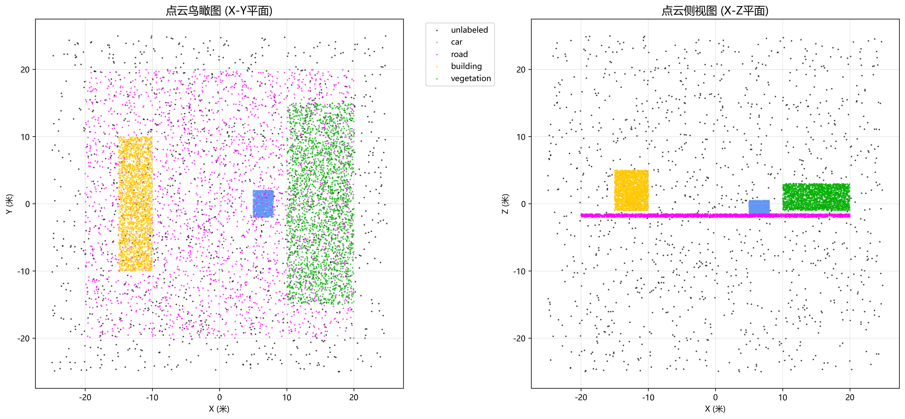
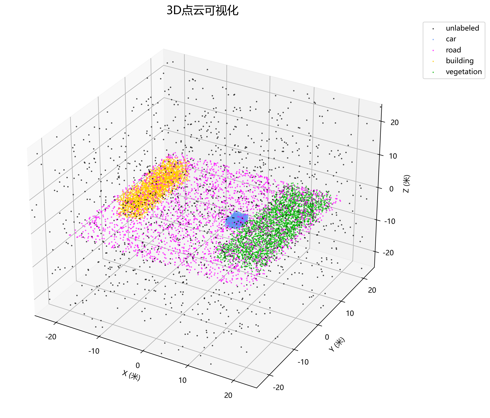
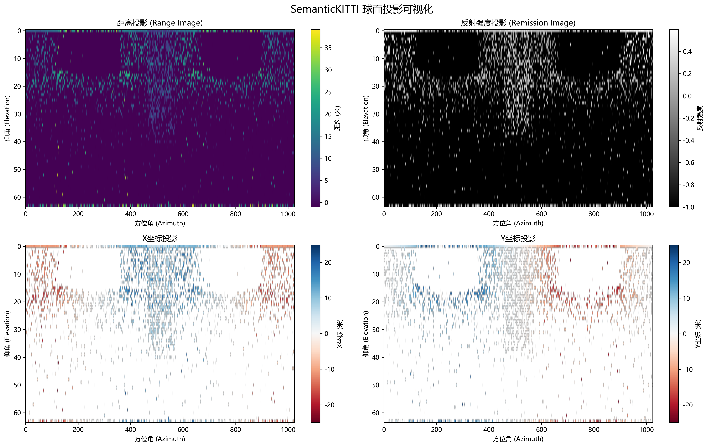

# SemanticKITTI API

## 项目介绍
SemanticKITTI API 是一个用于处理 SemanticKITTI 数据集的工具包，提供点云可视化、语义分割评估等功能。

**🆕 新增功能：其他模型点云图生成**
- 支持多种模型预测结果的可视化
- 生成2D和3D点云图
- 多模型性能比较
- 自动统计分析报告

## 技术栈
- Python 环境（需要 PyQt5 用于 GUI）
- OpenGL 可视化（vispy, PyOpenGL）
- 深度学习框架（PyTorch）
- 数据处理（numpy, matplotlib）
- 图像处理（PIL/Pillow）

## 可复现指南
1. 安装所有依赖：`pip install -r requirements.txt`
2. 检查现有脚本的可用性
3. 创建示例数据或使用现有数据进行测试
4. 运行可视化脚本验证功能

### 测试数据生成
- 使用 `generate_test_data.py` 脚本生成测试数据集（5个点云文件，每个包含10,000个点）

### 🆕 其他模型点云图生成
使用新的 `generate_model_pointclouds.py` 脚本：

#### 快速演示
```bash
# 运行演示模式，自动生成示例数据和可视化
python generate_model_pointclouds.py --demo
```

#### 单个模型可视化
```bash
python generate_model_pointclouds.py \
    --scan data/sequences/00/velodyne/000000.bin \
    --predictions model_output/000000.label \
    --model_names "我的模型" \
    --output results
```

#### 多模型比较
```bash
python generate_model_pointclouds.py \
    --scan data/sequences/00/velodyne/000000.bin \
    --predictions model1/pred.label model2/pred.label \
    --model_names "模型1" "模型2" \
    --output comparison
```

**生成的输出：**
- 2D可视化图（鸟瞰图、侧视图、前视图）
- 3D交互式可视化图
- 统计分析报告
- 多模型比较图

详细使用说明请参考：[MODEL_POINTCLOUD_GUIDE.md](MODEL_POINTCLOUD_GUIDE.md)

### 可视化
使用 `visualize.py` 脚本：
```bash
python visualize.py --dataset test_data --sequence 00
```

- 2D 鸟瞰图和侧视图
- 3D 散点图可视化
- 球面投影可视化
- 语义颜色映射

## 数据组织
数据集约 80G，包含 sequences、velodyne、labels 等。

## 效果图




更多细节请参考原文档和脚本。